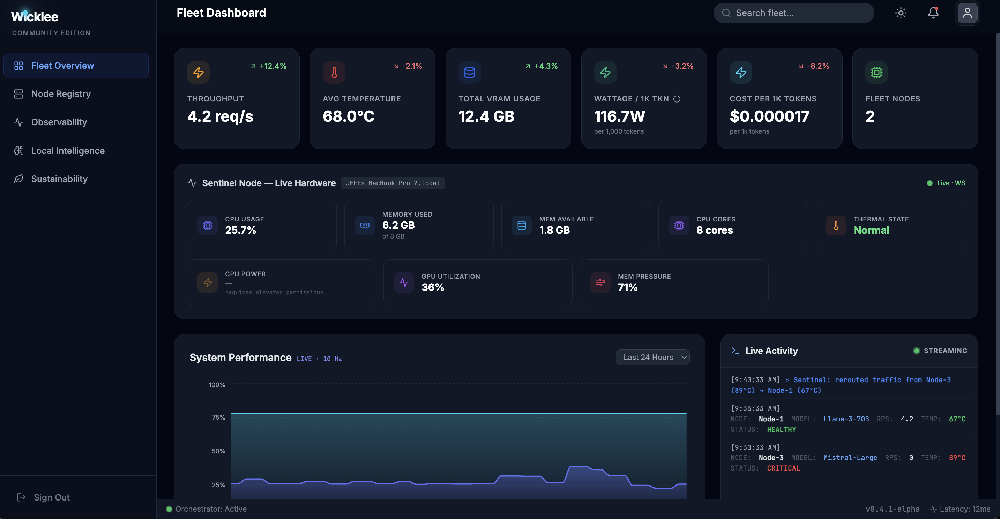

# Wicklee 🛰️

**Open-source GPU fleet monitor for teams running local AI inference.**

Wicklee is a single Rust binary that installs on any inference node — Ollama, vLLM, or custom stacks — and gives you a live hardware dashboard at `localhost:7700`. No cloud required. No data leaves your network until you choose.



---

## Install

```bash
# Coming soon — curl install script
# For now, build from source (see below)
```

> `sudo` is required only to copy the binary to `/usr/local/bin`. The agent runs without elevated permissions.

---

## What it monitors

| Metric | Apple Silicon | NVIDIA (Linux) |
|---|---|---|
| CPU usage % | ✅ | ✅ |
| Memory used / available | ✅ | ✅ |
| Memory pressure % | ✅ | — |
| GPU utilization % | ✅ sudoless | ✅ via NVML |
| Board power draw (W) | ⚠️ requires root | ✅ sudoless |
| Thermal state | ✅ sudoless | 🔜 |
| VRAM used / total | — | ✅ via NVML |

---

## Build from source

**Prerequisites:** Rust 1.75+, Node.js 18+

```bash
# Clone
git clone https://github.com/Wicklee/wicklee
cd wicklee

# Build frontend + agent (single command)
make install

# Run
wicklee
# → Dashboard at http://localhost:7700
```

---

## Architecture

Wicklee is a **single binary**. The React dashboard is compiled and embedded directly into the Rust agent at build time using `rust-embed` — no web server, no npm at runtime, no file paths to manage.

```
wicklee (single binary, ~700KB)
│
├── Axum HTTP server (port 7700)
│   ├── GET /          → embedded React dashboard
│   ├── GET /api/metrics → SSE stream, 1Hz telemetry
│   └── GET /ws        → WebSocket, 10Hz live charts
│
└── Hardware harvester (tokio background task)
    ├── sysinfo        → CPU, memory
    ├── ioreg          → GPU utilization (macOS, no sudo)
    ├── pmset          → thermal state (macOS, no sudo)
    ├── vm_stat        → memory pressure (macOS, no sudo)
    └── nvml-wrapper   → GPU metrics (Linux, no sudo)
```

**Sovereign by default.** Nothing leaves the machine until you explicitly pair it with a Fleet View account at [wicklee.dev](https://wicklee.dev).

---

## Fleet View

For teams running multiple nodes, [wicklee.dev](https://wicklee.dev) aggregates all paired agents into a single hosted dashboard.

- **Free:** up to 5 nodes
- **Team Edition:** unlimited nodes, 90-day history, Sentinel alerts — coming soon

To pair a node: run `wicklee --pair` or open `localhost:7700` and click **Connect to Fleet**.

```
┌─────────────────────────────────┐
│  Wicklee Fleet Pairing          │
│  Node Identity: WK-8821         │
│  Pairing Code:  847291          │
│  Enter at: wicklee.dev          │
│  Expires in: 5:00               │
└─────────────────────────────────┘
```

---

## Roadmap

### ✅ Phase 1 — The Standalone Sentinel
Single binary, embedded dashboard, Apple Silicon deep metal, sudoless, global CLI.

### 🔜 Phase 2 — The Multi-Node Fleet *(in progress)*
NVIDIA/NVML support, Fleet Connect pairing, hosted fleet aggregation on Railway.

### 📋 Phase 3 — The Intelligence Layer
Wattage-per-Token, Thermal Rerouting (Sentinel), Apple Neural Engine (ANE).

### 📋 Phase 4 — The Commercial Layer
Team Edition, Stripe, alert integrations (Slack/PagerDuty), curl install script.

---

## Why Wicklee?

Standard monitoring tools see CPU and RAM. They don't see GPU utilization, unified memory pressure, thermal state, or wattage-per-token. When an inference node overheats or degrades, you find out from a user — not a dashboard.

Wicklee fixes that. One binary. Zero dependencies. Your data stays on your hardware.

> *"Your fleet data never leaves your network until you choose."*

---

## Tools

- **[Wattage-per-Token Calculator](https://huggingface.co/spaces/Wicklee/Wattage-per-token)** — compare your GPU's real inference cost against cloud API pricing.

---

## License

[Business Source License 1.1](LICENSE) — free for individuals and teams under 5 nodes. Commercial use above 5 nodes requires a Team Edition license.

---

## Contributing

Issues and PRs welcome. See [docs/SPEC.md](docs/SPEC.md) for architecture details and [docs/ROADMAP.md](docs/ROADMAP.md) for what's coming next.
